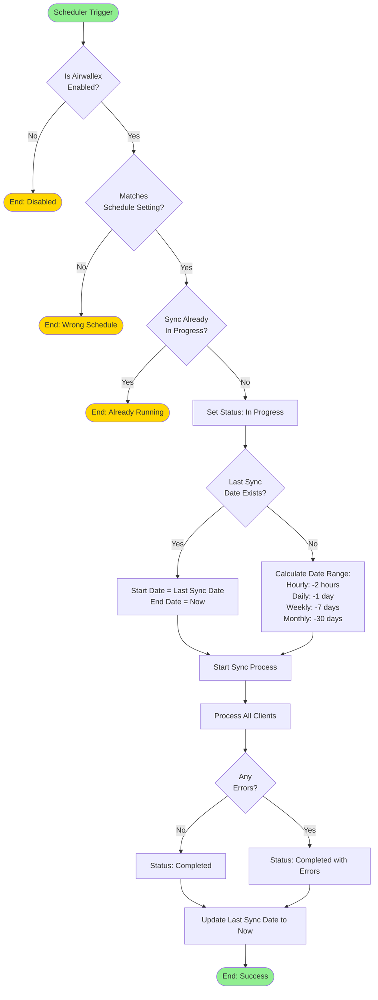

# Scheduled Sync Workflow

## Overview

Scheduled sync automatically syncs transactions at regular intervals using Frappe's scheduler. This is the recommended approach for keeping transactions up-to-date.

## Workflow Diagram



## Scheduler Functions

Located in `bank_integration/airwallex/scheduler.py`:

### `run_hourly_sync()`
- Triggered every hour by Frappe scheduler
- Syncs last 2 hours of transactions (first run) or from last sync date
- Best for high-transaction-volume accounts

### `run_daily_sync()`
- Triggered once per day (typically at midnight)
- Syncs yesterday's transactions (first run) or from last sync date
- Best for moderate transaction volumes

### `run_weekly_sync()`
- Triggered once per week
- Syncs last 7 days (first run) or from last sync date
- Best for low-transaction-volume accounts

### `run_monthly_sync()`
- Triggered once per month
- Syncs last 30 days (first run) or from last sync date
- Best for very low-transaction-volume accounts

## Execution Flow

### 1. Trigger Phase
```python
def run_hourly_sync():
    setting = frappe.get_single("Bank Integration Setting")

    # Check conditions
    if setting.enable_airwallex and \
       setting.sync_schedule == "Hourly" and \
       setting.sync_status != "In Progress":
        sync_scheduled_transactions("Bank Integration Setting", "Hourly")
```

### 2. Date Calculation Phase
```python
def sync_scheduled_transactions(setting_name, schedule_type):
    setting = frappe.get_single("Bank Integration Setting")

    # Prevent concurrent runs
    if setting.sync_status == "In Progress":
        return

    setting.db_set('sync_status', 'In Progress')

    end_date = frappe.utils.now_datetime()

    # Use incremental sync if possible
    if setting.last_sync_date:
        start_date = frappe.utils.get_datetime(setting.last_sync_date)
    else:
        # First run - calculate based on schedule
        if schedule_type == "Hourly":
            start_date = end_date - timedelta(hours=2)
        elif schedule_type == "Daily":
            start_date = end_date - timedelta(days=1)
        # ... etc
```

### 3. Sync Execution Phase
- Calls `sync_transactions(start_date, end_date, setting_name)`
- Processes all configured clients
- See [Common Sync Process](08-common-sync-process.md) for details

### 4. Completion Phase
```python
# On success
setting.db_set('last_sync_date', frappe.utils.now())
setting.db_set('sync_status', 'Completed')
```

## Advantages of Scheduled Sync

1. **Automatic**: No manual intervention required
2. **Incremental**: Only syncs new transactions since last run
3. **Efficient**: Smaller date ranges mean faster processing
4. **Reliable**: Runs even if no one is logged in
5. **Consistent**: Predictable execution times

## Configuration via hooks.py

Schedules are configured in `bank_integration/hooks.py`:

```python
scheduler_events = {
    "hourly": [
        "bank_integration.airwallex.scheduler.run_hourly_sync"
    ],
    "daily": [
        "bank_integration.airwallex.scheduler.run_daily_sync"
    ],
    "weekly": [
        "bank_integration.airwallex.scheduler.run_weekly_sync"
    ],
    "monthly": [
        "bank_integration.airwallex.scheduler.run_monthly_sync"
    ]
}
```

## Monitoring Scheduled Syncs

### Via UI
- Check **Sync Status** in Bank Integration Setting
- View **Last Sync Date** to confirm recent execution
- Monitor **Processed Records** counter

### Via Logs
- Check **Bank Integration Log** for sync history
- Review **Error Log** for failed syncs
- Check Frappe scheduler logs: `bench --site [site-name] doctor`

## Troubleshooting

### Scheduler Not Running
```bash
# Check if scheduler is enabled
bench --site [site-name] doctor

# Enable scheduler
bench --site [site-name] enable-scheduler

# Check scheduler status
bench --site [site-name] show-scheduler-status
```

### Sync Stuck "In Progress"
- Manually reset status in Bank Integration Setting
- Or click **Restart Sync** button

### Missed Syncs
- Check if Airwallex integration is enabled
- Verify sync schedule matches setting
- Check error logs for authentication failures

## Best Practices

1. **Choose Appropriate Schedule**: Match to your transaction volume
2. **Monitor Initial Runs**: Watch first few syncs to ensure proper operation
3. **Review Logs Regularly**: Check for errors or warnings
4. **Keep Credentials Updated**: Renew API keys before expiry
5. **Test After Changes**: Use manual sync to test after configuration changes
