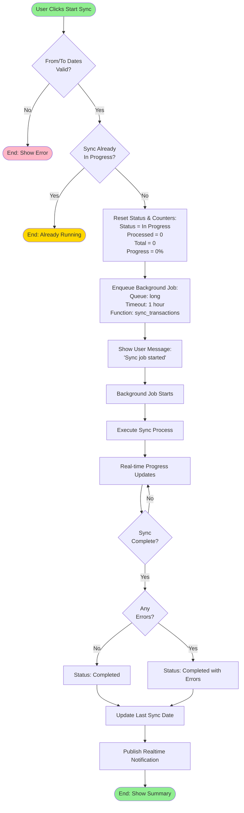

# Manual Sync Workflow

## Overview

Manual sync (Old Transactions Sync) allows you to sync historical transactions for a specific date range. This is useful for:
- Initial data migration
- Backfilling missed transactions
- Re-syncing specific periods
- Testing the integration

## Workflow Diagram



## Step-by-Step Process

### 1. User Configuration

1. Navigate to **Bank Integration Setting**
2. Enable **Sync Old Transactions** checkbox
3. Set **From Date** (start of date range)
4. Set **To Date** (end of date range)
5. Click **Save**
6. Click **Start Sync** button (appears after saving)

### 2. Validation

The system validates:
- Both From Date and To Date are provided
- From Date is before or equal to To Date
- No other sync is currently in progress
- At least one Airwallex client is configured

### 3. Job Enqueueing

```python
@frappe.whitelist()
def start_transaction_sync(self):
    # Update status
    self.db_set('sync_status', 'In Progress')
    self.db_set('processed_records', 0)
    self.db_set('total_records', 0)
    self.db_set('sync_progress', 0)
    self.db_set('last_sync_date', frappe.utils.now())

    # Enqueue background job
    enqueue(
        'bank_integration.airwallex.transaction.sync_transactions',
        queue='long',
        timeout=3600,  # 1 hour
        from_date=str(self.from_date),
        to_date=str(self.to_date),
        setting_name=self.name
    )
```

### 4. Background Execution

The job runs in the background, allowing the user to:
- Continue working in ERPNext
- Close the browser
- Monitor progress from Bank Integration Setting page

### 5. Progress Tracking

Real-time updates are published via `frappe.publish_realtime()`:

```javascript
// UI receives updates
frappe.realtime.on('transaction_sync_progress', (data) => {
    // Update progress bar
    // Show processed/total counts
    // Display current status
});
```

### 6. Completion

Upon completion, the user receives a notification with:
- Total transactions processed
- Number of transactions created
- Number of duplicates skipped
- Number of errors encountered

## UI Actions

### Start Sync Button
- Appears when `sync_old_transactions` is checked
- Initiates the background sync job
- Disabled while sync is in progress

### Restart Sync Button
- Appears when sync is complete or failed
- Resets status and starts a new sync
- Useful for retrying failed syncs

### Stop Sync Button
- Appears while sync is in progress
- Marks sync as stopped
- Background job may take time to actually stop

## Date Range Considerations

### Large Date Ranges
- May take significant time to process
- Risk of timeout (1-hour limit)
- Consider breaking into smaller ranges

### Recommended Ranges
- **First-time sync**: 1-3 months at a time
- **Regular backfill**: 1-2 weeks at a time
- **Testing**: 1-7 days

### Overlapping Dates
- Safe to sync overlapping date ranges
- Duplicate detection prevents redundant entries
- Useful for ensuring no gaps

## Monitoring Progress

### Via UI
Watch real-time updates in Bank Integration Setting:
- **Sync Status**: Current status
- **Processed Records**: Count of processed transactions
- **Total Records**: Estimated total (may update during sync)
- **Sync Progress**: Percentage complete

### Via Logs
- **Bank Integration Log**: Detailed sync events
- **Error Log**: Any errors encountered
- **Bank Transaction**: Created transaction records

## Error Recovery

### Common Errors

| Error | Cause | Solution |
|-------|-------|----------|
| "From and To dates are required" | Missing dates | Set both dates before starting |
| "From date cannot be greater than To date" | Invalid date range | Correct the date order |
| "No Airwallex clients configured" | No clients set up | Add at least one client |
| "Sync already in progress" | Concurrent sync attempt | Wait for current sync to complete |
| "Authentication failed" | Invalid credentials | Check and update API credentials |
| "Timeout" | Date range too large | Use smaller date range |

### Recovery Steps

1. **If Sync Fails**:
   - Check Error Log for details
   - Fix the underlying issue
   - Click **Restart Sync**

2. **If Sync Hangs**:
   - Wait for timeout (1 hour)
   - Manually reset status to "Not Started"
   - Click **Restart Sync**

3. **If Partial Sync**:
   - Note last successful transaction date
   - Adjust From Date to continue from there
   - Start new sync

## Best Practices

1. **Test First**: Start with a small date range (1-7 days) to test
2. **Break Up Large Ranges**: Sync 1-3 months at a time for initial migration
3. **Monitor Actively**: Watch first few syncs to catch issues early
4. **Check Duplicates**: Review that duplicate detection is working
5. **Verify Currency Matching**: Ensure transactions map to correct bank accounts
6. **Document Your Process**: Note date ranges synced for audit trail
7. **Schedule Off-Hours**: Run large syncs during low-usage periods

## Comparison with Scheduled Sync

| Aspect | Manual Sync | Scheduled Sync |
|--------|-------------|----------------|
| Trigger | User action | Automatic (cron) |
| Date Range | User-specified | Auto-calculated |
| Execution | Background job | Direct execution |
| Use Case | Historical data | Ongoing sync |
| Timeout | 1 hour | No timeout |
| Frequency | On-demand | Regular intervals |
