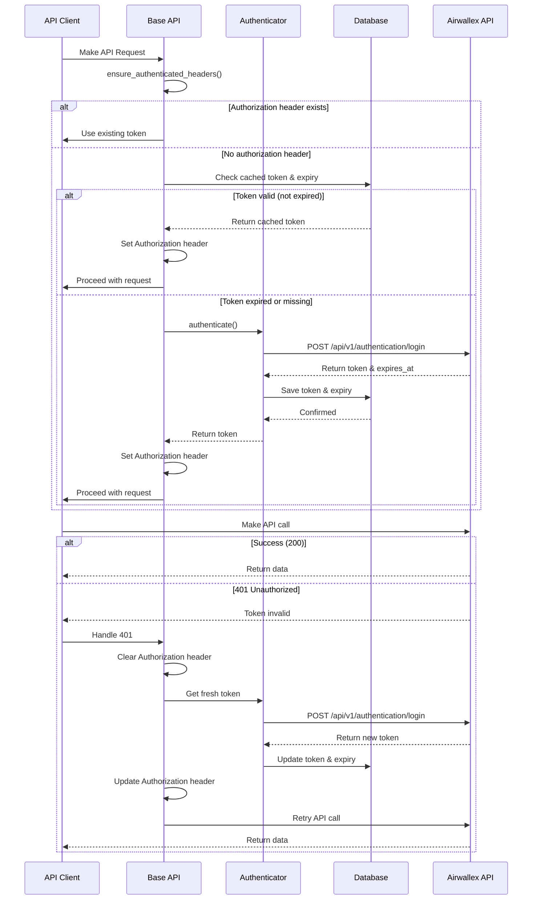

# Authentication & Token Management

## Overview

The Bank Integration App uses a sophisticated token management system that:
- Caches tokens in the database for persistence
- Automatically refreshes expired tokens
- Handles 401 Unauthorized errors gracefully
- Minimizes authentication requests

## Token Caching Strategy

### Database Storage

Tokens are stored in the database rather than in-memory cache:
- **Advantage**: Persist across server restarts
- **Advantage**: Shared across multiple workers/processes
- **Advantage**: Better auditability
- **Location**: `Bank Integration Setting` doctype

### Token Fields

```python
token = DF.Small Text  # The bearer token
token_expiry = DF.Datetime  # When the token expires
```

## Authentication Flow



## Key Functions

### `ensure_authenticated_headers()`

Located in `base_api.py`:

```python
def ensure_authenticated_headers(self):
    """Ensure headers have valid bearer token"""
    # Only get token if we don't already have one in headers
    if "Authorization" not in self.headers:
        token = self.get_valid_token()
        self.headers["Authorization"] = f"Bearer {token}"
```

**Purpose**: Adds Authorization header only if not already present.

**When Called**: Before every API request (GET, POST, PUT, DELETE)

### `get_valid_token()`

```python
def get_valid_token(self):
    """Get a valid bearer token, authenticate if needed"""
    # Check if we have a cached token that's still valid in the database
    self.airwallex_setting.reload()
    cached_token = self.airwallex_setting.token
    expires_at = self.airwallex_setting.token_expiry

    if cached_token and expires_at:
        # Check if token is still valid (with 5 minute buffer)
        if frappe.utils.now_datetime() < frappe.utils.get_datetime(expires_at) - timedelta(minutes=5):
            return cached_token

    # Token expired or doesn't exist, get a new one
    return self.authenticate_and_cache_token()
```

**Purpose**: Returns a valid token, fetching new one if needed.

**Logic**:
1. Reload settings from database (get latest token)
2. Check if token exists and is not expired (with 5-min buffer)
3. Return cached token if valid
4. Otherwise, authenticate and get new token

### `authenticate_and_cache_token()`

```python
def authenticate_and_cache_token(self):
    """Authenticate and cache the token in database"""
    auth = AirwallexAuthenticator()
    auth_response = auth.authenticate()

    if not auth_response or not auth_response.get('token'):
        frappe.throw("Failed to authenticate with Airwallex API")

    token = auth_response['token']
    expires_at = auth_response.get('expires_at')

    # Save token to database
    self.airwallex_setting.token = token
    if expires_at:
        if isinstance(expires_at, str):
            expires_datetime = datetime.fromisoformat(expires_at.replace('Z', '+00:00'))
        else:
            expires_datetime = expires_at
        self.airwallex_setting.token_expiry = expires_datetime

    self.airwallex_setting.save(ignore_permissions=True)
    frappe.db.commit()

    return token
```

**Purpose**: Authenticate with Airwallex and cache the token.

**Process**:
1. Call Airwallex authentication endpoint
2. Extract token and expiry from response
3. Save to database (Bank Integration Setting)
4. Commit transaction
5. Return token

### 401 Error Handling

Located in `_make_request()`:

```python
# Check for authentication errors (401 Unauthorized)
if response.status_code == 401 and not self.is_auth_instance:
    frappe.logger().info("Token expired, refreshing and retrying request")

    # Clear the authorization header to force token refresh
    if "Authorization" in self.headers:
        del self.headers["Authorization"]

    # Get new token and update headers
    token = self.authenticate_and_cache_token()
    self.headers["Authorization"] = f"Bearer {token}"
    request_headers["Authorization"] = f"Bearer {token}"

    # Retry the request with new token
    response = requests.request(method.value, url, params=params, json=json, headers=request_headers)
```

**Purpose**: Automatically recover from token expiration.

**Process**:
1. Detect 401 response
2. Clear existing Authorization header
3. Get fresh token
4. Update headers
5. Retry the original request
6. Return result (success or failure)

## Token Lifecycle

### 1. First Request
- No token in database
- Authenticate with Airwallex
- Cache token with expiry
- Use token for request

### 2. Subsequent Requests
- Token exists in database
- Check if still valid (5-min buffer)
- Use cached token
- No authentication needed

### 3. Token Near Expiry
- Token expires in < 5 minutes
- Proactively authenticate
- Update cached token
- Use new token

### 4. Token Expired
- API returns 401
- Automatically authenticate
- Update cached token
- Retry original request

## Multi-Client Support

Each Airwallex client can have its own token:

```python
# Client-specific token fields in Airwallex Client child table
token = DF.Small Text
token_expiry = DF.Datetime
```

When initializing API:

```python
api = FinancialTransactions(
    client_id=client.airwallex_client_id,
    api_key=client.get_password("airwallex_api_key"),
    api_url=settings.api_url
)
```

The API client manages tokens for that specific client.

## Security Considerations

### Token Storage
- Tokens stored in database (not in logs)
- API keys stored as Password fields (encrypted)
- Tokens automatically expire (limited lifetime)

### Token Exposure
- Never logged or shown in UI
- Masked in error messages
- Not transmitted unnecessarily

### Token Refresh
- Automatic refresh on expiry
- No manual intervention required
- Minimal downtime during refresh

## Performance Optimization

### Minimized Authentication Requests
- Token reused until expiry
- 5-minute buffer prevents last-minute failures
- Single authentication serves multiple requests

### Database vs Cache
- Database ensures consistency across workers
- Slight overhead vs in-memory cache
- Trade-off for reliability and persistence

### Concurrent Requests
- Multiple simultaneous requests use same token
- No redundant authentication
- Thread-safe token management

## Troubleshooting

### "Failed to authenticate"
**Cause**: Invalid credentials or API unavailable
**Solution**:
- Verify client ID and API key
- Check API URL is correct
- Test authentication via UI button

### Token Keeps Expiring
**Cause**: System time incorrect or Airwallex token lifetime changed
**Solution**:
- Verify server time is accurate
- Check token expiry in database
- Contact Airwallex if lifetime changed

### 401 Errors Despite Fresh Token
**Cause**: Token invalidated server-side
**Solution**:
- Check Airwallex account status
- Verify API key hasn't been revoked
- Re-enter credentials if needed

## Best Practices

1. **Don't Force Refresh**: Let the system manage tokens automatically
2. **Monitor Token Expiry**: Check logs for frequent re-authentication (may indicate issues)
3. **Update Credentials Carefully**: Changing credentials clears cached tokens
4. **Test After Changes**: Use test authentication after updating credentials
5. **Secure API Keys**: Treat API keys like passwords, never expose in logs or UI
