# Common Sync Process

## Overview

Both scheduled and manual syncs converge on a common sync process that handles the actual data synchronization. This document details that shared process.

## Process Flow Diagram

```mermaid
graph TB
    Start([sync_transactions called]) --> ConvertDates[Convert Dates to ISO8601 Format]
    ConvertDates --> CheckClients{Airwallex Clients<br/>Configured?}
    CheckClients -->|No| ThrowError[Throw Error:<br/>No Clients Configured]
    CheckClients -->|Yes| LoopClients[Loop Through Each Client]

    LoopClients --> SyncClient[sync_client_transactions]
    SyncClient --> InitAPI[Initialize FinancialTransactions API<br/>with Client Credentials]
    InitAPI --> EnsureAuth[Ensure Authentication Headers]

    EnsureAuth --> CheckAuthHeader{Authorization<br/>Header Exists?}
    CheckAuthHeader -->|Yes| MakeAPICall[Make API Call:<br/>GET /financial_transactions]
    CheckAuthHeader -->|No| GetToken[Get Valid Token from DB/API]
    GetToken --> MakeAPICall

    MakeAPICall --> CheckResponse{API Response<br/>Status?}
    CheckResponse -->|401 Unauthorized| RefreshToken[Auto-refresh Token & Retry]
    RefreshToken --> CheckRetry{Retry<br/>Success?}
    CheckRetry -->|No| LogAPIError[Log API Error]
    CheckRetry -->|Yes| ProcessTxns[Process Transactions]
    CheckResponse -->|Success 200| ProcessTxns
    CheckResponse -->|Error 4xx/5xx| LogAPIError

    ProcessTxns --> LoopTxns[Loop Through Transactions]
    LoopTxns --> CheckDuplicate{Transaction ID<br/>Exists in DB?}
    CheckDuplicate -->|Yes| SkipTxn[Skip Transaction<br/>Increment Skipped Counter]
    CheckDuplicate -->|No| MapData[Map Airwallex → ERPNext]

    MapData --> CheckCurrency{Transaction Currency<br/>== Bank Account Currency?}
    CheckCurrency -->|Yes| SetBankAccount[Set Bank Account]
    CheckCurrency -->|No| BlankBankAccount[Leave Bank Account Blank]

    SetBankAccount --> CreateDoc[Create Bank Transaction Doc]
    BlankBankAccount --> CreateDoc
    CreateDoc --> InsertDoc[doc.insert]

    InsertDoc --> CheckInsert{Insert<br/>Success?}
    CheckInsert -->|Success| IncrementCreated[Increment Created Counter]
    CheckInsert -->|Duplicate Error| SkipTxn
    CheckInsert -->|Other Error| LogTxnError[Log Error<br/>Increment Error Counter]

    SkipTxn --> UpdateProgress[Update Progress<br/>Publish Realtime Event]
    IncrementCreated --> UpdateProgress
    LogTxnError --> UpdateProgress

    UpdateProgress --> CheckMoreTxns{More<br/>Transactions<br/>in Page?}
    CheckMoreTxns -->|Yes| LoopTxns
    CheckMoreTxns -->|No| CheckMorePages{Has<br/>More Pages?}

    CheckMorePages -->|Yes| NextPage[Increment page_num]
    NextPage --> MakeAPICall
    CheckMorePages -->|No| ClientComplete[Client Sync Complete]

    ClientComplete --> CheckMoreClients{More<br/>Clients?}
    CheckMoreClients -->|Yes| LoopClients
    CheckMoreClients -->|No| FinalUpdate[Calculate Final Status]

    FinalUpdate --> CheckErrors{Any<br/>Errors?}
    CheckErrors -->|Yes| StatusWithErrors[Status: Completed with Errors]
    CheckErrors -->|No| StatusCompleted[Status: Completed]

    StatusWithErrors --> UpdateLastSync[Update Last Sync Date]
    StatusCompleted --> UpdateLastSync
    UpdateLastSync --> PublishComplete[Publish Completion Notification]
    PublishComplete --> End([End: Sync Complete])

    LogAPIError --> FailedStatus[Set Status: Failed]
    ThrowError --> FailedStatus
    FailedStatus --> EndFailed([End: Sync Failed])

    style Start fill:#90EE90
    style End fill:#90EE90
    style EndFailed fill:#FFB6C6
    style CheckDuplicate fill:#FFA500
    style CheckCurrency fill:#FFA500
```



## Function Breakdown

### `sync_transactions(from_date, to_date, setting_name)`

**Purpose**: Main orchestrator for syncing transactions

**Parameters**:
- `from_date`: Start date for sync
- `to_date`: End date for sync
- `setting_name`: Name of Bank Integration Setting doc (typically "Bank Integration Setting")

**Process**:
1. Load Bank Integration Setting
2. Validate clients are configured
3. Convert dates to ISO8601 format
4. Loop through each configured client
5. Call `sync_client_transactions()` for each
6. Aggregate results (processed, created, errors)
7. Update final status
8. Update last sync date

**Returns**: Implicitly via status updates

### `sync_client_transactions(client, from_date_iso, to_date_iso, settings)`

**Purpose**: Sync transactions for a specific Airwallex client

**Parameters**:
- `client`: Airwallex Client child doc
- `from_date_iso`: ISO8601 formatted start date
- `to_date_iso`: ISO8601 formatted end date
- `settings`: Bank Integration Setting doc

**Process**:
1. Initialize `FinancialTransactions` API client
2. Authenticate (get/verify token)
3. Paginate through API results
4. Process each transaction:
   - Check for duplicates
   - Map to ERPNext format
   - Validate currency match
   - Create Bank Transaction doc
5. Handle errors gracefully
6. Update progress periodically

**Returns**: `(processed, created)` tuple

### `transaction_exists(transaction_id)`

**Purpose**: Check if transaction already exists

**Parameters**:
- `transaction_id`: Airwallex transaction ID

**Process**:
```python
return frappe.db.exists("Bank Transaction", {"transaction_id": transaction_id})
```

**Returns**: Boolean

## Pagination Handling

```python
page_num = 0
page_size = 100

while True:
    response = api.get_list(
        from_created_at=from_date_iso,
        to_created_at=to_date_iso,
        page_num=page_num,
        page_size=page_size
    )

    if not response or not response.get('items'):
        break

    transactions = response.get('items', [])
    has_more = response.get('has_more', False)

    # Process transactions...

    if not has_more:
        break

    page_num += 1
```

**Key Points**:
- Fetches 100 transactions per page
- Continues until `has_more` is False
- Prevents memory issues with large datasets

## Progress Tracking

```python
setting.update_sync_progress(total_processed, total_processed, "In Progress")

# Inside update_sync_progress():
progress = (processed / total * 100) if total > 0 else 0
self.db_set('processed_records', processed)
self.db_set('total_records', total)
self.db_set('sync_progress', progress)
self.db_set('sync_status', status)

frappe.publish_realtime(
    'transaction_sync_progress',
    {'processed': processed, 'total': total, 'progress': progress},
    user=frappe.session.user
)
```

**Purpose**: Keep user informed of progress in real-time

## Counters

The sync process tracks multiple counters:

| Counter | Description |
|---------|-------------|
| `total_processed` | Total transactions examined |
| `total_created` | Transactions successfully created |
| `total_skipped` | Duplicates skipped |
| `total_errors` | Transactions that failed |

**Calculation**:
```
total_processed = total_created + total_skipped + total_errors
```

## Transaction Processing Loop

```python
for txn in transactions:
    try:
        transaction_id = txn.get('id')

        # Duplicate check
        if transaction_exists(transaction_id):
            total_skipped += 1
            total_processed += 1
            continue

        # Map data
        erpnext_txn = map_airwallex_to_erpnext(txn, client.bank_account)

        # Validate
        if not erpnext_txn.get('transaction_id'):
            total_errors += 1
            total_processed += 1
            continue

        # Create doc
        bank_txn_doc = frappe.get_doc(erpnext_txn)
        bank_txn_doc.insert()

        total_created += 1
        total_processed += 1

    except frappe.DuplicateEntryError:
        total_skipped += 1
        total_processed += 1

    except Exception as e:
        total_errors += 1
        total_processed += 1
        frappe.log_error(traceback.format_exc(), f"Transaction Error - {txn.get('id')}")
```

**Key Features**:
- Errors don't stop the sync
- Each transaction counted once
- Detailed error logging
- Graceful duplicate handling

## Status Determination

```python
final_status = "Completed" if total_errors == 0 else "Completed with Errors"
setting.update_sync_progress(total_processed, total_processed, final_status)
```

**Logic**:
- **Completed**: No errors occurred
- **Completed with Errors**: Some transactions failed but sync finished
- **Failed**: Sync couldn't complete (set elsewhere)

## Final Summary

```python
summary_msg = (
    f"Transaction sync completed. "
    f"Processed: {total_processed}, Created: {total_created}, "
    f"Skipped: {total_skipped}, Errors: {total_errors}"
)

frappe.logger().info(summary_msg)
bi_log.create_log(summary_msg)

frappe.publish_realtime(
    'transaction_sync_complete',
    {
        'processed': total_processed,
        'created': total_created,
        'skipped': total_skipped,
        'errors': total_errors,
        'status': final_status,
        'message': f"Sync completed. Created {total_created}, skipped {total_skipped} duplicates."
    },
    user=frappe.session.user
)
```

**Delivery**:
- Console log
- Bank Integration Log
- Real-time notification to user
- Status fields in Bank Integration Setting

## Performance Considerations

### Batch Processing
- API pagination reduces memory usage
- Processes 100 transactions at a time
- Updates progress every 10 transactions

### Database Optimization
- Single duplicate check per transaction
- Bulk status updates (not per-transaction)
- Commit frequency balanced for performance

### Error Isolation
- Single transaction error doesn't stop sync
- Client error doesn't stop other clients
- Comprehensive try-catch blocks

## Best Practices

1. **Monitor Progress**: Watch real-time updates during first few syncs
2. **Review Logs**: Check Bank Integration Log after completion
3. **Validate Results**: Spot-check created Bank Transactions
4. **Check Counters**: Ensure processed = created + skipped + errors
5. **Investigate Errors**: Review Error Log for failed transactions
6. **Test Scenarios**: Test with various date ranges and data volumes
