# Bank Integration App Workflow

This document describes the transaction synchronization workflow for the Bank Integration app with Airwallex.

## Overview

The app supports two types of transaction synchronization:
1. **Scheduled Sync**: Automatic periodic syncing based on configured schedule (Hourly/Daily/Weekly/Monthly)
2. **Old Transactions Sync**: Manual sync for historical transactions within a specified date range

## Workflow Diagram

```mermaid
graph TB
    Start([Start]) --> CheckSyncType{Sync Type?}

    %% Scheduled Sync Path
    CheckSyncType -->|Scheduled Sync| SchedulerTrigger[Scheduler Triggers:<br/>Hourly/Daily/Weekly/Monthly]
    SchedulerTrigger --> CheckEnabled{Is Airwallex<br/>Enabled?}
    CheckEnabled -->|No| EndDisabled([End: Disabled])
    CheckEnabled -->|Yes| CheckSchedule{Matches<br/>Schedule?}
    CheckSchedule -->|No| EndNoMatch([End: Wrong Schedule])
    CheckSchedule -->|Yes| CheckInProgress1{Sync Already<br/>In Progress?}
    CheckInProgress1 -->|Yes| EndInProgress1([End: Already Running])
    CheckInProgress1 -->|No| SetStatusProgress1[Set Status: In Progress]
    SetStatusProgress1 --> CheckLastSync{Last Sync<br/>Date Exists?}
    CheckLastSync -->|Yes| UseLastSync[Start Date = Last Sync Date]
    CheckLastSync -->|No| CalcSchedule[Calculate Date Based on Schedule:<br/>Hourly: -2 hours<br/>Daily: -1 day<br/>Weekly: -7 days<br/>Monthly: -30 days]
    UseLastSync --> StartScheduledSync[Start Scheduled Sync]
    CalcSchedule --> StartScheduledSync

    %% Old Transactions Sync Path
    CheckSyncType -->|Old Transactions Sync| UserTrigger[User Clicks Start Sync]
    UserTrigger --> ValidateDates{From/To Dates<br/>Valid?}
    ValidateDates -->|No| EndInvalidDates([End: Invalid Dates])
    ValidateDates -->|Yes| CheckInProgress2{Sync Already<br/>In Progress?}
    CheckInProgress2 -->|Yes| EndInProgress2([End: Already Running])
    CheckInProgress2 -->|No| SetStatusProgress2[Set Status: In Progress<br/>Reset Counters]
    SetStatusProgress2 --> EnqueueJob[Enqueue Background Job:<br/>Queue: long<br/>Timeout: 1 hour]
    EnqueueJob --> StartOldSync[Start Old Transactions Sync]

    %% Common Sync Process
    StartScheduledSync --> CommonSync[sync_transactions function]
    StartOldSync --> CommonSync

    CommonSync --> ConvertDates[Convert Dates to ISO8601 Format]
    ConvertDates --> CheckClients{Airwallex Clients<br/>Configured?}
    CheckClients -->|No| ThrowError[Throw Error:<br/>No Clients Configured]
    CheckClients -->|Yes| LoopClients[Loop Through Each Client]

    LoopClients --> SyncClient[sync_client_transactions]
    SyncClient --> InitAPI[Initialize FinancialTransactions API<br/>with Client Credentials]
    InitAPI --> EnsureAuth[Ensure Authentication Headers]

    EnsureAuth --> CheckAuthHeader{Authorization<br/>Header Exists?}
    CheckAuthHeader -->|No| GetToken[Get Valid Token]
    CheckAuthHeader -->|Yes| MakeAPICall

    GetToken --> CheckCachedToken{Check Database:<br/>Token Exists & Valid?}
    CheckCachedToken -->|Yes| UseCachedToken[Use Cached Token]
    CheckCachedToken -->|No| Authenticate[Authenticate with Airwallex]
    Authenticate --> CacheToken[Cache Token & Expiry<br/>in Database]
    CacheToken --> UseCachedToken
    UseCachedToken --> MakeAPICall[Make API Call to Get Transactions]

    MakeAPICall --> CheckAPIResponse{API Response<br/>Status?}
    CheckAPIResponse -->|401 Unauthorized| RefreshToken[Clear Auth Header<br/>Get Fresh Token]
    RefreshToken --> RetryAPI[Retry API Call]
    RetryAPI --> CheckRetryResponse{Retry<br/>Success?}
    CheckRetryResponse -->|No| LogAPIError[Log API Error]
    CheckRetryResponse -->|Yes| ProcessTransactions
    CheckAPIResponse -->|Success| ProcessTransactions[Process Transactions]
    CheckAPIResponse -->|Other Error| LogAPIError

    ProcessTransactions --> LoopTransactions[Loop Through Each Transaction]
    LoopTransactions --> CheckDuplicate{Transaction ID<br/>Exists in DB?}
    CheckDuplicate -->|Yes| SkipTransaction[Skip Transaction<br/>Increment Skipped Counter]
    CheckDuplicate -->|No| MapTransaction[Map Airwallex to ERPNext]

    MapTransaction --> CheckCurrency{Transaction Currency<br/>Matches Bank Account<br/>Currency?}
    CheckCurrency -->|Yes| SetBankAccount[Set Bank Account Field]
    CheckCurrency -->|No| LeaveBankBlank[Leave Bank Account Blank]

    SetBankAccount --> CreateDoc[Create Bank Transaction Document]
    LeaveBankBlank --> CreateDoc
    CreateDoc --> InsertDoc[Insert Document]
    InsertDoc --> HandleInsertError{Insert<br/>Success?}
    HandleInsertError -->|Duplicate Error| SkipTransaction
    HandleInsertError -->|Other Error| LogTxnError[Log Transaction Error<br/>Increment Error Counter]
    HandleInsertError -->|Success| IncrementCreated[Increment Created Counter]

    SkipTransaction --> CheckMoreTxns{More<br/>Transactions?}
    LogTxnError --> CheckMoreTxns
    IncrementCreated --> CheckMoreTxns
    CheckMoreTxns -->|Yes| LoopTransactions
    CheckMoreTxns -->|No| UpdateProgress[Update Sync Progress]

    UpdateProgress --> CheckMorePages{Has More<br/>Pages?}
    CheckMorePages -->|Yes| NextPage[Increment Page Number]
    NextPage --> MakeAPICall
    CheckMorePages -->|No| CheckMoreClients{More<br/>Clients?}

    CheckMoreClients -->|Yes| LoopClients
    CheckMoreClients -->|No| FinalUpdate[Update Final Status]

    FinalUpdate --> CheckErrors{Any<br/>Errors?}
    CheckErrors -->|Yes| StatusWithErrors[Status: Completed with Errors]
    CheckErrors -->|No| StatusCompleted[Status: Completed]

    StatusWithErrors --> UpdateLastSync[Update Last Sync Date]
    StatusCompleted --> UpdateLastSync
    UpdateLastSync --> PublishNotification[Publish Realtime Notification:<br/>Processed, Created, Skipped, Errors]
    PublishNotification --> End([End: Sync Complete])

    LogAPIError --> UpdateStatusFailed[Set Status: Failed]
    ThrowError --> UpdateStatusFailed
    UpdateStatusFailed --> EndFailed([End: Sync Failed])

    style Start fill:#90EE90
    style End fill:#90EE90
    style EndFailed fill:#FFB6C6
    style EndDisabled fill:#FFD700
    style EndInProgress1 fill:#FFD700
    style EndInProgress2 fill:#FFD700
    style EndNoMatch fill:#FFD700
    style EndInvalidDates fill:#FFB6C6
    style CommonSync fill:#87CEEB
    style SyncClient fill:#87CEEB
    style CheckDuplicate fill:#FFA500
    style CheckCurrency fill:#FFA500
```

## Key Components

### 1. Scheduler Functions
Located in `bank_integration/airwallex/scheduler.py`:
- `run_hourly_sync()` - Runs every hour
- `run_daily_sync()` - Runs once per day
- `run_weekly_sync()` - Runs once per week
- `run_monthly_sync()` - Runs once per month

Each scheduler function checks:
- Is Airwallex enabled?
- Does the schedule match?
- Is a sync already in progress?

### 2. Sync Functions
Located in `bank_integration/airwallex/transaction.py`:

#### `sync_scheduled_transactions(setting_name, schedule_type)`
- Handles scheduled syncs from cron jobs
- Calculates date range based on last sync date or schedule type
- Sets sync status to "In Progress"
- Calls `sync_transactions()`

#### `sync_transactions(from_date, to_date, setting_name)`
- Main sync orchestrator
- Loops through all configured Airwallex clients
- Converts dates to ISO8601 format
- Calls `sync_client_transactions()` for each client
- Aggregates results and updates final status

#### `sync_client_transactions(client, from_date_iso, to_date_iso, settings)`
- Syncs transactions for a specific client
- Initializes FinancialTransactions API with client credentials
- Fetches transactions from Airwallex API (paginated)
- Processes each transaction:
  - Checks for duplicates using `transaction_exists()`
  - Maps Airwallex data to ERPNext format
  - Validates currency match before assigning bank account
  - Creates Bank Transaction document
- Handles API errors and retries with fresh tokens

### 3. Authentication & Token Management
Located in `bank_integration/airwallex/api/base_api.py`:

#### Token Caching Strategy
- Tokens are cached in the database (Bank Integration Setting)
- Token expiry is checked before each API call
- Fresh token is requested only when:
  - No cached token exists
  - Cached token is expired (with 5-minute buffer)
  - API returns 401 Unauthorized

#### Authentication Flow
1. `ensure_authenticated_headers()` - Checks if Authorization header exists
2. `get_valid_token()` - Gets token from cache or authenticates
3. On 401 error:
   - Clears existing Authorization header
   - Calls `authenticate_and_cache_token()`
   - Updates token in database
   - Retries the request automatically

### 4. Data Mapping
Located in `bank_integration/airwallex/utils.py`:

#### `map_airwallex_to_erpnext(txn, bank_account)`
- Maps Airwallex transaction to ERPNext Bank Transaction format
- Checks if transaction currency matches bank account currency
- Only assigns bank account if currencies match
- Leaves bank account blank if currencies don't match
- Determines deposit vs withdrawal based on amount sign

### 5. Duplicate Prevention
- `transaction_exists(transaction_id)` - Checks if transaction ID exists in database
- Duplicate check performed before creating each transaction
- Handles `DuplicateEntryError` exceptions gracefully
- Tracks skipped transactions in counters

## Sync Status States

| Status | Description |
|--------|-------------|
| Not Started | Initial state, no sync has been initiated |
| In Progress | Sync is currently running |
| Completed | Sync finished successfully with no errors |
| Completed with Errors | Sync finished but some transactions had errors |
| Failed | Sync failed completely |

## Configuration Fields

### Bank Integration Setting
- `enable_airwallex` - Enable/disable the integration
- `sync_schedule` - Schedule type (Hourly/Daily/Weekly/Monthly)
- `sync_old_transactions` - Enable manual sync for old transactions
- `from_date` / `to_date` - Date range for old transaction sync
- `last_sync_date` - Timestamp of last successful sync
- `sync_status` - Current sync status
- `token` - Cached authentication token
- `token_expiry` - Token expiration datetime
- `airwallex_clients` - Table of configured clients

### Airwallex Client (Child Table)
- `airwallex_client_id` - Client ID from Airwallex
- `airwallex_api_key` - API Key (password field)
- `bank_account` - Linked ERPNext Bank Account
- `token` - Client-specific cached token
- `token_expiry` - Client-specific token expiry

## Error Handling

- API errors are logged with truncated client IDs for privacy
- Failed transactions are logged but don't stop the sync
- Concurrent sync prevention using status checks
- Automatic retry on 401 authentication errors
- Graceful handling of duplicate entries

## Progress Tracking

- Real-time progress updates via `frappe.publish_realtime()`
- Counters tracked: processed, created, skipped, errors
- Progress percentage calculated and displayed
- Final notification sent on completion
